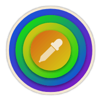
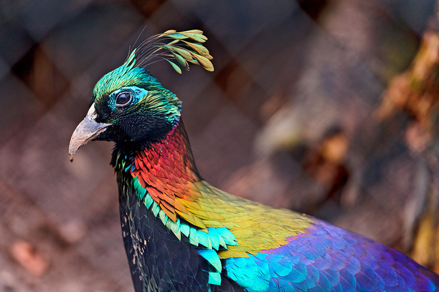
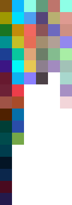

<div align="center">


# Vibrancy
Extract prominent colours from images


[](https://www.nuget.org/packages/TurnerSoftware.Vibrancy/)
</div>

## Overview

Provides basic colour extraction from images into "swatches".
As configured by a `SwatchDefinition`, each swatch has a min/max/target saturation an value (see [HSV](https://en.wikipedia.org/wiki/HSL_and_HSV)).
To avoid extracting too many similar colours, a [CIELAB](https://en.wikipedia.org/wiki/CIELAB_color_space)-based [perception comparison](https://en.wikipedia.org/wiki/Color_difference#CIE76) is performed using a minimum colour threshold (via `PaletteOptions`, default: `25`).

The extraction process is computationally intensive as it processes every individual pixel in an image.
It is _highly recommended_ resizing large images before running `GetSwatches` and avoiding setting `MinimumColorThreshold` too low.
The smaller the image, the less colours will be able to be extracted.

Powered by [ImageSharp](https://github.com/SixLabors/ImageSharp/).

## Results

Input image (640x426)



Output (default settings, rendered to an image)



Columns represent swatch definitions (Dark Vibrant, Vibrant, Light Vibrant, Dark Muted, Muted, Light Muted).
Rows represent the colours found in each.

## Swatch Definitions

There are 6 built-in swatch definitions:
- Dark Vibrant
- Vibrant
- Light Vibrant
- Dark Muted
- Muted
- Light Muted

While these are likely suitable for most applications, you can create your own swatch definitions too:

```csharp
new SwatchDefinition("My Swatch Definition", MinSaturation: 0.55f, TargetSaturation: 1, MinValue: 0.1f, TargetValue: 0.3f, MaxValue: 0.64f);
```

## Usage

### Simple Usage

```csharp
using SixLabors.ImageSharp;
using SixLabors.ImageSharp.PixelFormats;
using TurnerSoftware.Vibrancy;

var palette = new Palette(new PaletteOptions(new[]
{
	SwatchDefinition.DarkVibrant,
	SwatchDefinition.Vibrant,
	SwatchDefinition.LightVibrant,
	SwatchDefinition.DarkMuted,
	SwatchDefinition.Muted,
	SwatchDefinition.LightMuted
}));

var image = await Image.LoadAsync<Rgb24>("path/to/image.jpg");
image.Mutate(x => {
	x.Resize(200, 0);
});
var swatches = palette.GetSwatches(image);

var darkVibrantSwatch = swatches[0];
foreach (var swatchColor in vibrantSwatch.GetColors())
{
	var rgb = swatchColor.Rgb;
	//Your per-colour processing goes here
}
```

### Creating the example output

```csharp
using SixLabors.ImageSharp;
using SixLabors.ImageSharp.PixelFormats;
using SixLabors.ImageSharp.Processing;
using SixLabors.ImageSharp.Processing.Processors.Transforms;
using TurnerSoftware.Vibrancy;

var palette = new Palette(new PaletteOptions(new[]
{
	SwatchDefinition.DarkVibrant,
	SwatchDefinition.Vibrant,
	SwatchDefinition.LightVibrant,
	SwatchDefinition.DarkMuted,
	SwatchDefinition.Muted,
	SwatchDefinition.LightMuted
}));

var file = "path/to/image.jpg";
var image = await Image.LoadAsync<Rgb24>(file);
var swatches = palette.GetSwatches(image);

var outputImage = new Image<Rgba32>(swatches.Count, swatches.Max(s => s.Count));
outputImage.Mutate(x =>
{
	x.BackgroundColor(Color.Transparent);
});
for (var x = 0; x < swatches.Count; x++)
{
	var swatch = swatches[x];
	var colours = swatch.GetColors()
		.OrderByDescending(c => (int)(c.Hsv.V * 3))
		.ThenByDescending(c => (int)(c.Hsv.S * 3))
		.ThenBy(c => c.Hsv.H)
		.ToArray();
	for (var y = 0; y < colours.Length; y++)
	{
		outputImage[x, y] = colours[y].Rgb;
	}
}
outputImage.Mutate(x =>
{
	x.Resize(swatches.Count * 20, 0, new NearestNeighborResampler());
});
await outputImage.SaveAsPngAsync($"output-{Path.GetFileNameWithoutExtension(file)}.png");
```